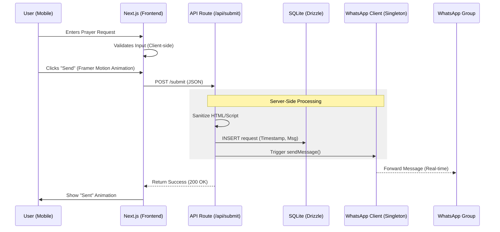

# Product Requirements Document (PRD)
**Project Name:** Project Intercessor (Anonymous Prayer Service)  
**Version:** 2.0  
**Status:** Approved for Development  
**Date:** 2026-02-12  

---

## 1. Executive Summary
The goal of Project Intercessor is to provide a digital safe haven for youth group members to share prayer requests without the social anxiety of public identification. The system will be a lightweight web application hosted on a free-tier AWS EC2 instance. It serves two functions: broadcasting requests instantly to a WhatsApp group via a bot and maintaining a persistent, public "Prayer Wall" for members to view past requests.

## 2. Objectives
* **Anonymity:** Ensure 100% sender anonymity (no IP logging, no user tracking).
* **Accessibility:** Provide a frictionless web interface accessible via mobile browsers.
* **Persistence:** Maintain a history of requests for a "Prayer Wall" view.
* **Integration:** Real-time forwarding of messages to the designated WhatsApp group.
* **Cost Efficiency:** Zero operating costs (leverage AWS Free Tier).

---

## 3. User Stories

### 3.1 The Member (Submitter)
* *As a youth member, I want to visit a web link and type a prayer request without logging in.*
* *As a member, I want to click "Send" and receive immediate confirmation that my prayer was received.*
* *As a member, I want to see a "Prayer Wall" of all previous requests so I can pray for others.*

### 3.2 The Leader (Admin)
* *As a leader, I want requests to appear in our WhatsApp group automatically so the community can respond immediately.*
* *As a leader, I want to ensure that no technical logs exist that could reveal who sent a specific message.*

---

## 4. Functional Requirements

### 4.1 Web Interface (Frontend)
* **FR-01 (Submission Page):** A simple, mobile-responsive landing page containing:
    * A text area for the message (Max 1000 chars).
    * A primary "Send Prayer Request" button.
    * A secondary link/button to "View Prayer Wall".
* **FR-02 (Prayer Wall Page):** A read-only page displaying a list of all submitted requests in reverse chronological order (newest first).
    * Display format: Date/Time (Generic) + Message Content.
* **FR-03 (Feedback):** Upon successful submission, the user receives a visual confirmation message.

### 4.2 Backend System
* **FR-04 (API Endpoint):** A RESTful endpoint (`POST /submit`) to accept form data.
* **FR-05 (Validation):**
    * Reject empty messages.
    * Sanitize HTML/Script tags to prevent XSS attacks on the Prayer Wall.
* **FR-06 (WhatsApp Integration):** The backend must utilize a headless browser to interface with WhatsApp Web.
    * Trigger: On valid POST to `/submit`.
    * Action: Send text to Target Group ID.
    * Format: `🙏 *New Anonymous Request:* [Message]`

### 4.3 Data Persistence
* **FR-07 (Storage):** Store valid requests in a local SQLite database.
* **FR-08 (Privacy Logic):** The application must explicitly **NOT** store:
    * Source IP Address.
    * User-Agent strings.
    * Browser fingerprints.

---

## 5. Technical Architecture (Revised)

### 5.1 Technology Stack

* **Framework:** **Next.js 14+ (App Router)**.
* *Rationale:* Provides robust Server Side Rendering (SSR) for the "Prayer Wall" (SEO and fast initial load) and React Client Components for the interactive form.

* **Language:** **TypeScript**.
* *Rationale:* Ensures type safety, critical for maintaining the message payload structure between the frontend, DB, and WhatsApp API.

* **Styling System:** **Tailwind CSS**.
* *Rationale:* Utility-first CSS for rapid, responsive mobile-first development.

* **Animation Library:** **Framer Motion**.
* *Rationale:* Lightweight React animation library to handle micro-interactions (button presses, success checkmarks, page transitions) for the "stunning" feel.

* **Database ORM:** **Drizzle ORM** (with `better-sqlite3`).
* *Rationale:* Extremely lightweight compared to Prisma. Crucial for AWS Free Tier (t2.micro) where RAM is limited (1GB).

* **WhatsApp Integration:** `whatsapp-web.js` running via a **Custom Node.js Server** entry point.
* **Process Manager:** **PM2**.

### 5.2 Application Architecture (The "Hybrid" Model)

Unlike a standard Next.js deployment (which is often serverless), this application requires a persistent process to keep the WhatsApp connection alive.

* **Custom Server Entry (`server.js`):** We will not use the default `next start`. Instead, we will write a custom Node.js server that:
1. Initializes the `whatsapp-web.js` client and handles QR code generation.
2. Initializes the Next.js app to handle HTTP requests.
3. Exposes an internal singleton service that allows Next.js API routes to "talk" to the active WhatsApp client.

* **Data Flow:**
1. **User** submits form via Next.js Frontend.
2. **Next.js API Route** (`POST /api/submit`) validates data and saves to **SQLite**.
3. **API Route** invokes the shared **WhatsApp Client** instance to broadcast the message.
4. **WhatsApp Client** pushes message to the WhatsApp Group.

### 5.3 Infrastructure (AWS Free Tier Optimization)

* **Instance:** t2.micro or t3.micro (1 vCPU, 1GB RAM).
* **Memory Management (Critical):**
* Since Next.js + Puppeteer (Chrome) is memory-intensive, we **MUST** configure a 2GB Swap File on the Ubuntu instance.
* *Chromium Flag:* Run Puppeteer with `--no-sandbox` and `--disable-setuid-sandbox` to reduce overhead.

### 5.4 Architecture Diagram

---

## 6. UI/UX Design Specifications (New Section)

To meet the requirement for a "stunning, modern look," the development team must adhere to the following design system:

### 6.1 Visual Identity (The "Sanctuary" Theme)

* **Palette:** Deep indigos and soft whites (Dark Mode first).
* *Background:* Gradient mesh (Midnight Blue to deep Violet).
* *Cards:* Glassmorphism effect (Translucent white with blur `backdrop-filter: blur(10px)`).

* **Typography:** Sans-serif, geometric fonts (e.g., *Inter* or *Geist*) for readability on small screens.

### 6.2 Micro-Animations (Framer Motion)

* **Submission Button:**
* *State:* `WhileHover` (scale 1.05), `WhileTap` (scale 0.95).
* *Loading:* Replace text with a smooth spinner.
* *Success:* Button morphs into a green checkmark.

* **Page Transitions:**
* Smooth fade-in/slide-up when navigating between "Write Prayer" and "Prayer Wall".

* **List Items (Wall):**
* `StaggerChildren` effect: When the wall loads, prayer cards should slide in one by one rather than appearing all at once.

### 6.3 Responsiveness

* **Touch Targets:** All inputs and buttons must have a minimum height of 44px for mobile thumbs.
* **Focus States:** Glow effects on active input fields instead of default browser outlines.

---

## 7. Implementation Roadmap (Revised for Next.js)

### Phase 1: Core Setup & UI

1. Initialize Next.js project: `npx create-next-app@latest --typescript --tailwind`.
2. Setup Drizzle ORM with SQLite.
3. **Dev Task:** Build the `PrayerCard` and `SubmissionForm` components using Framer Motion.
4. **Dev Task:** Create the glassmorphism layout wrapper.

### Phase 2: The "Bot-Server" Hybrid

1. Create `server.ts` (Custom Server).
2. Implement `WhatsAppService` class (Singleton pattern).
3. Integrate `whatsapp-web.js` initialization into `server.ts`.
4. Create the QR Code display:
* *Dev Mode:* Log QR to console.
* *Prod Mode:* Expose a secured route `/admin/qr` to scan the code from the server logs or a protected UI.

### Phase 3: Deployment (AWS EC2)

1. Provision Ubuntu 22.04 on t2.micro.
2. **OS Config:** `sudo fallocate -l 2G /swapfile` (Essential to prevent Puppeteer crash).
3. Install Node.js 20 (LTS) and PM2.
4. Build Next.js app locally (`npm run build`) and upload `.next`, `public`, and `package.json` to EC2 (to save CPU on the server).
5. Start with PM2: `pm2 start dist/server.js --name "intercessor"`.

---

## 8. Updated Risks & Mitigations

| Risk | Impact | Mitigation |
| --- | --- | --- |
| **High Memory Usage** | Next.js + Chrome (Puppeteer) exceeds 1GB RAM, causing crash. | **1.** Enable 2GB Swap on EC2.  

  **2.** Use `drizzle-orm` instead of Prisma.  

  **3.** Restart app automatically via PM2 if memory exceeds 900MB. |
| **Cold Starts** | If app sleeps, the WhatsApp connection drops. | Use PM2 to keep the process alive 24/7. **Do not** use Vercel/Netlify for deployment (they kill idle processes). |
| **Build Failure on EC2** | `npm run build` freezes the t2.micro. | **CI/CD Strategy:** Build the app on a local machine or GitHub Actions, then only transfer the *artifacts* (production build) to the AWS server. |

### Next Steps for the Team:

1. **Backend Lead:** Prototype the `server.ts` custom server to prove that Next.js and `whatsapp-web.js` can run in the same process.
2. **Frontend Lead:** Set up the Tailwind config and glassmorphism utility classes.
3. **Scrum Master:** Create stories for "Swap File Setup" and "GitHub Actions Build Pipeline" to address the memory constraints immediately.